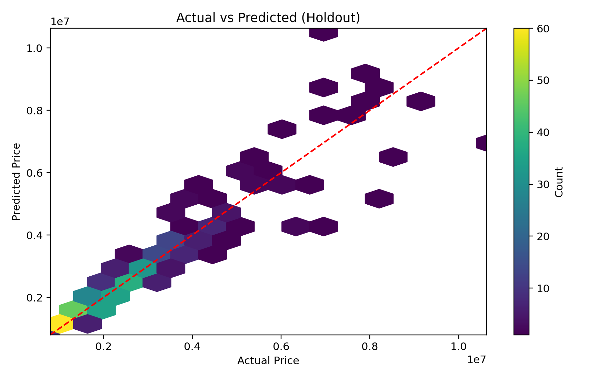
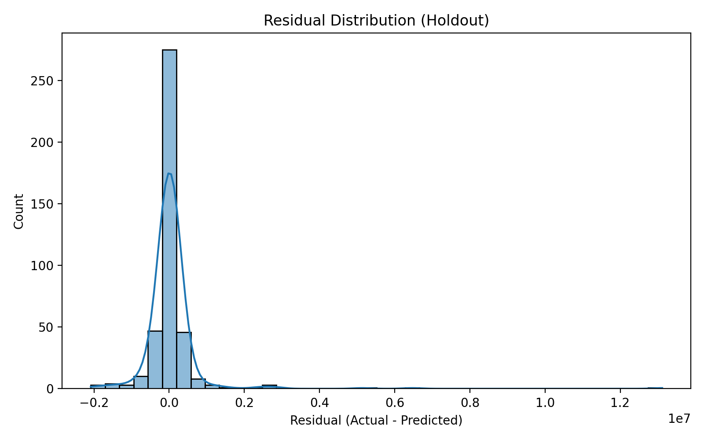

# Housing price prediction 

## Feature Engineering
- Log-transformed skewed numeric variables
- Standardised continuous predictors
- Added polynomial & interaction terms for linear models
- Added Area/Age and Age buckets

## Hyperparameter Tuning

XGBoost hyperparameters were optimised using a structured **sequential stepwise tuning strategy** to reduce search complexity and improve stability.

The key parameters were grouped and tuned in stages:

- **Group 1:** `max_depth`, `min_child_weight`  
- **Group 2:** `subsample`, `colsample_bytree`  
- **Group 3:** `learning_rate`, `num_boost_round`  

Tuning procedure:
1. Initialise `learning_rate = 0.1` and `num_boost_round = 1000`.
2. Tune **Group 1** via cross-validated RMSE.
3. Fix Group 1 at optimal values and tune **Group 2**.
4. Fix Groups 1–2 and tune **Group 3** last.

At each stage, previously tuned parameters were fixed while remaining parameters stayed at default values.  

This staged optimisation reduces the dimensionality of the hyperparameter space, improving computational efficiency while maintaining model performance.

## Final Model Selection

Selected XGBoost based on lowest RMSE






## Running the notebook

### Install dependencies (Python 3.12)
```bash
pip install -r requirements.txt
```


### Outputs
- Processed data: `data/processed/`
- Model artefacts: `models/`
- Figures: `reports/figures/`
