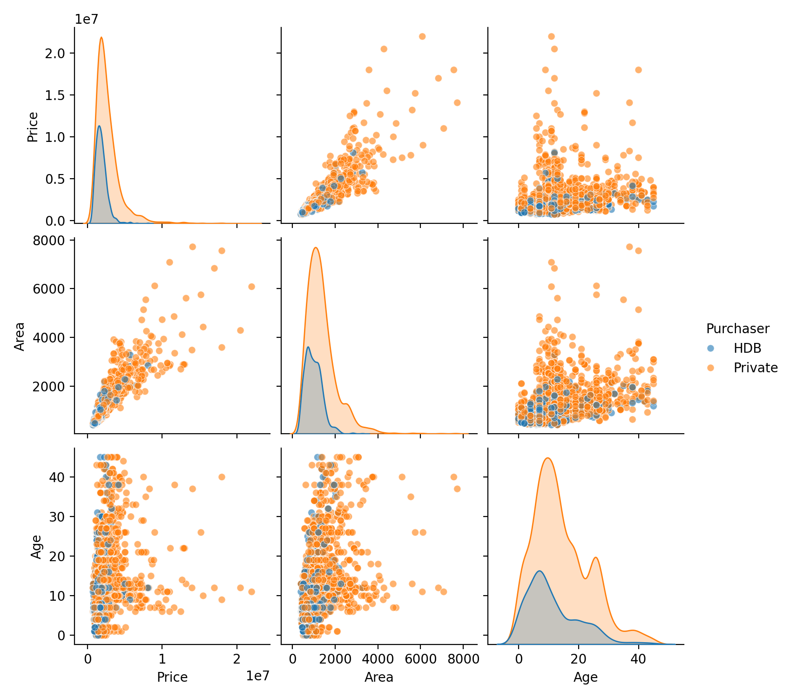
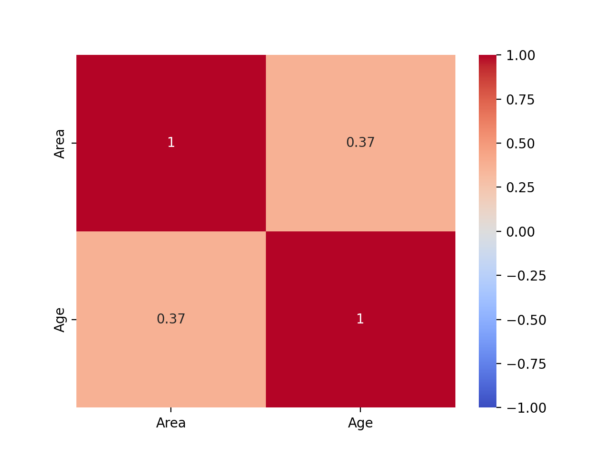

# Beginners-guide-to-tuning-boosted-trees:

## Dataset

We will use a 2024 Singapore housing prices dataset which includes characteristics of the property as well as the buyer had a HDB (Public) or private property. 

## EDA






## Data preprocessing and Feature Engineering

Based on our EDA, we: 
- Log-transformed skewed numeric variables
- Standardised continuous variables
- Added polynomial terms for linear models
- Added Area/Age metric and Age buckets

We don't have to add polynomial or interaction terms for our xgboost pipeline because the non linear nature of tree models will capture such relationships by design, however you can chose to add specific terms if you have domain knowledge that suggests those are important to simplify the search space.

## Hyperparameter Tuning

For this project, XGBoost hyperparameters were optimised using a structured sequential stepwise tuning strategy.

The key parameters were grouped and tuned in stages:

- **Group 1:** `max_depth`, `min_child_weight`  
- **Group 2:** `subsample`, `colsample_bytree`  
- **Group 3:** `learning_rate`, `num_boost_round`  

We control over fitting by tuning these hyper parameters. The hyper parameters in group 1 go first as they can be thought of as the soft mixers that controls potential interactions locally within each tree, improving generalization and reducing over fitting, but can require more trees or lower training accuracy. More specifically, `max_depth` sets how many 'layers' each tree can grow to while `min_child_weight`sets how much data support a tree leaf needs before the model will split. 

Tuning procedure:
1. Initialise `learning_rate = 0.1` and `num_boost_round = 1000`.
2. Tune Group 1 via cross-validated RMSE.
3. Fix Group 1 at optimal values and tune Group 2.
4. Fix Groups 1–2 and tune Group 3 last.

At each stage, previously tuned parameters were fixed while remaining parameters stayed at default values.  

The idea is that this staged optimisation reduces the dimensionality of the hyperparameter space, improving computational efficiency while maintaining model performance when working with limited RAM.

## Final Model Selection

Selected XGBoost based on lowest test RMSE

Visualiztion of the predictions on Central2024testP


## Running the notebook

### Install dependencies and run in vscode (Python 3.12.x)
```bash
python3.12 -m venv .venv
source .venv/bin/activate
pip install .
```


### Outputs
- Processed data: `data/processed/`
- Figures: `reports/figures/`
